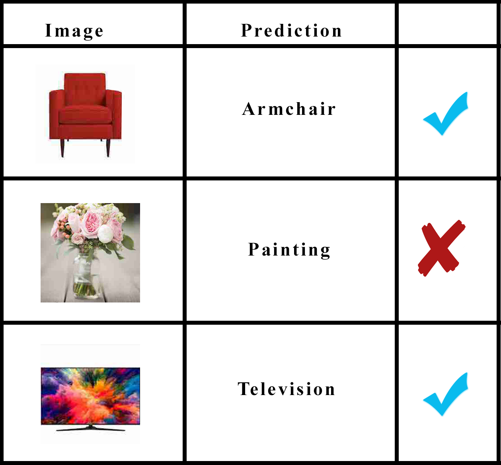
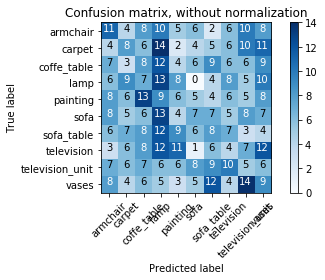

# BBM406 Project Predicting Furnitures In Living Rooms
In this project, we predict the 10 top furnitures in a living room. We have 10 classes which are  Armchair, Carpet, Coffee Table, Lamp, Painting, Sofa, Sofa Table, Television, Television Unit and Vases. To select best algorithm for this work, we compare 3 different algorithms which are Convolutional Neural Network, Multilayer Perceptron and K - Nearest Neighbor and we come up with 56.8 accuracy from convolutional neural network so we decide to continue our way with it. And we take 56.8 as our base accuracy and try to evaluate it and at the end we get 75.28 accuracy. 
## Motivation
Home robots, smart homes and interactive homes with their owner make human lives easy. These require  recognizing all pieces of the furnitures in the home to give the homeowners more control and some features in their dream homes. For simplicity, we just start with classifying top 10 furnitures in an living room. 
## Dataset
We collected our own dataset using some Python Library and manually.
## Brief Description For The Files
* **beautifulsoap.py**\
This code to download images from websites. To specify the url address;
```
site = 'http://pixabay.com'
```
change the value of "site" in the code.
* **convertjpg.py**\
This code is used to change the extension of the all images to the '.jpg'. To run this code, just change the all folder names in the code.
* **knn.py**\
This code runs the k-nearest neighbor algorithm. It classifies the images using knn algorithm. Because of we have a lot of images we cannot get a result from this algorithm. And also the format of the input should like the below to run this algorithm.
```
  -folder_name
     -all_images
```
In the code, our folder_name is 'train' to give a different folder name put the path of the folder in the below lines.
```
DIR = 'train'
x = len(glob.glob('train\*'))
print(x) #it prints the number of images in the folder
```
* **mlp.py**\
This code classifies the images using multilayer perceptron algorithm. We get 56.43 accuracy from this method. The format of the input should like the below to run this algorithm.
```
  -folder_name
     -all_images
```
In the code, our folder_name is 'train' to give a different folder name put the path of the folder in the below lines.
```
DIR = 'train'
x = len(glob.glob('train\*'))
print(x) #it prints the number of images in the folder
```
**Note:** In the input layer, there are 768 nodes; in hidden layers, there are 522 and 351 nodes respectively; in output layer, there are 10 nodes. 
* **cnn.py**\
This code classifies the images using convolutional neural network algorithm. We get 75.28 accuracy from this code. The input should be as below:
```
  -folder_name
     -class 1 --> folder
        -all images that belong class 1
     - class 2 --> folder
        -all images that belong class 2
     ...
```
**Note:** To run the code, the class names(which will be specified by the folders) must be same for all train, validation and test datasets.
**Note:** We used dataset folder for the convolutional neural network algorithm.
## Results 
After train the convolutional neural network model, we also want to see what model say about images. So we just give the 3 furnitures and compare the results. These furnitures are an armchair, a vase and a television. The model predicts armchair and television correctly but it predicts wrongly for the vase. See the table below:\
\
And the below is confusion matrix:\

## Future Work
As we mentioned before we get inspired by home robots, smart homes and interactive homes with their owner. So we should work on more objects like sleeping room objects, kitchen objects, bathroom objects etc. In addition, home robots, smart homes and interactive homes should do any work perfectly that means we should increase the accuracy. To achieve this, we should use convolutional neural network models such as AlexNet, GoogleNet etc. Instead of our own model or we may work with a more powerful computer to run pretrained models. After achieving all of these, we can embed the algorithm into a circuit or a robot.
## Demo
For demo watch the project's video: https://www.youtube.com/watch?v=EblMVu0S9L0&rel=0 \
And for more details, read the report.pdf

>
